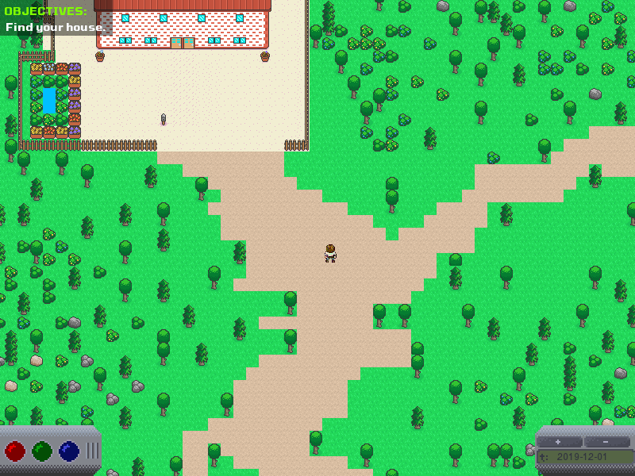
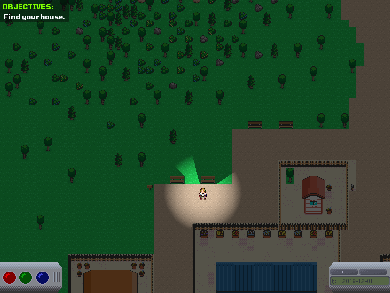

<p align="center">
    
    
</p>

# LeapOfTime

Leap of time is a small python based game.

## Usage

To run the game you just need to run the

```
python .
```

command.

Have fun!

## Authors

* **[Martin Kondor](https://github.com/MartinKondor)**

<p align="center"><a href="https://www.patreon.com/bePatron?u=17006186" data-patreon-widget-type="become-patron-button"></a></p>

## License

Copyright &copy; Martin Kondor 2019

This repository is licensed under the ```BSD 3-Clause``` license.
See the [LICENSE](./LICENSE) file for more details.

